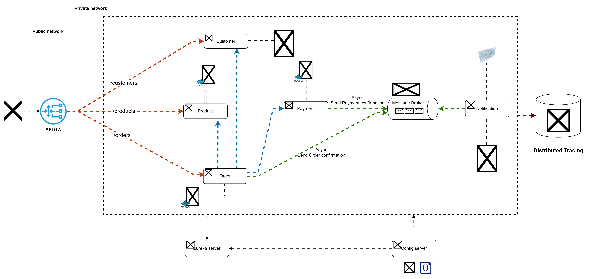

# E-Commerce Microservices Architecture

## Overview
This project implements an **E-Commerce Microservices Architecture** with Spring Boot, using various microservices for handling different functionalities such as orders, payments, products, and notifications. The system follows a **private and public network separation** to ensure security and scalability.

## Architecture Diagram


## Technologies Used
- **API Gateway:** Spring Cloud Gateway
- **Service Discovery:** Eureka Server
- **Configuration Management:** Spring Cloud Config
- **Authentication & Authorization:** Keycloak
- **Database:** MongoDB, PostgreSQL
- **Message Broker:** Apache Kafka
- **Distributed Tracing:** Zipkin
- **Containers:** Docker

## Microservices
The system is composed of the following microservices:

### 1. API Gateway
- Routes requests to the appropriate microservices.
- Handles authentication, authorization, and rate limiting.

### 2. Customer Service
- Manages customer-related data.
- Stores customer details in MongoDB.

### 3. Product Service
- Handles product catalog management.
- Exposes `/products` endpoint for retrieving product details.
- Uses PostgreSQL for storing product data.

### 4. Order Service
- Manages order creation and processing.
- Stores order information in PostgreSQL.
- Calls **Payment Service** for payment processing.

### 5. Payment Service
- Processes payments for orders.
- Uses PostgreSQL for storing payment transactions.
- Sends **asynchronous** payment confirmation messages to Kafka.

### 6. Notification Service
- Listens to Kafka topics for payment and order confirmations.
- Sends notifications to users.
- Stores notifications in MongoDB.

### 7. Eureka Server
- Handles service discovery for microservices.
- Allows dynamic scaling of services.

### 8. Config Server
- Centralized configuration management for all services.

### 9. Keycloak
- Manages authentication and authorization for all microservices.
- Provides OAuth2 and OpenID Connect support.
- Ensures secure access control for APIs.

## Communication Flow
1. **API Gateway routes requests** to respective microservices (`Customer`, `Product`, `Order`).
2. **Order Service interacts** with Payment Service to process payments.
3. **Payment confirmation is published** to Kafka.
4. **Notification Service listens** for payment/order confirmation messages and sends notifications.
5. **Keycloak handles authentication & authorization** before accessing protected endpoints.
6. **Zipkin enables distributed tracing** for monitoring service calls.

## Deployment
- Use **Docker** to containerize services.
- Use **Kubernetes** or **Docker Compose** for orchestration.

## How to Run
1. Clone the repository:
   ```sh
   git clone <repo_url>
   cd <project_directory>
   ```
2. Start required services (MongoDB, PostgreSQL, Kafka, Keycloak, etc.)
3. Run microservices:
   ```sh
   mvn spring-boot:run -pl customer-service
   mvn spring-boot:run -pl product-service
   # Repeat for other services
   ```
4. Start Keycloak and configure realms, clients, and users.

## Monitoring & Debugging
- **Kafka UI**: Monitor message queues.
- **Zipkin UI**: View distributed tracing logs.
- **Eureka Dashboard**: Check registered services.
- **Keycloak Admin Console**: Manage authentication and authorization settings.

## Future Improvements
- Implement caching using **Redis**.
- Deploy using **Kubernetes** for better scalability.
- Enhance security policies in **Keycloak**.

---
This README provides an overview of the architecture. Feel free to contribute or suggest improvements!

